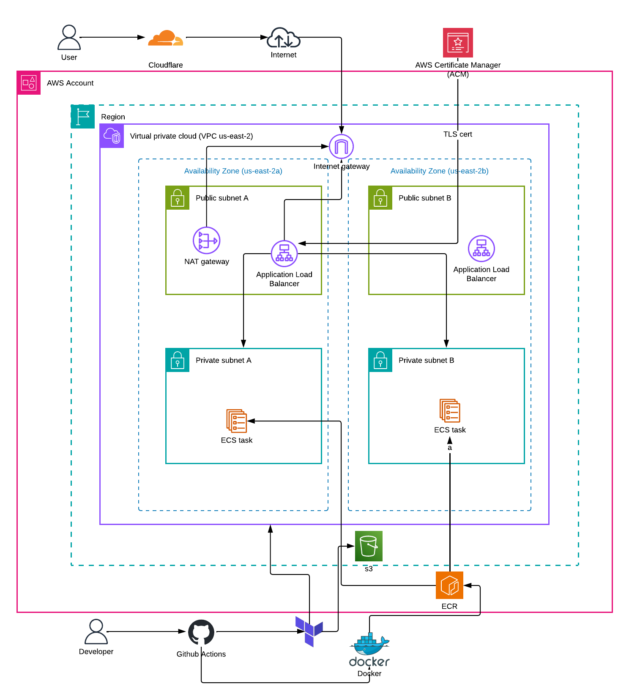

# IT Tools — Production Deployment on AWS

A production deployment of [it-tools](https://github.com/CorentinTh/it-tools) — a handy collection of developer utilities. containerised with Docker and deployed to AWS ECS Fargate using Terraform, with a fully automated CI/CD pipeline via GitHub Actions.

**Live at: https://it-tools.abdijalil.com**

---

## Overview

This project takes an existing open-source app and deploys it. The goal wasn't just to get it running, it was to do it right, with infrastructure as code, automated deployments, HTTPS, and a custom domain. The journey started with manually clickOps through the AWS Console to understand every service, then rebuilding everything as Terraform and automating it with GitHub Actions so a single `git push` handles the entire pipeline.

---

## Architecture



## Tech Stack

| Category | Tool |
|----------|------|
| App | it-tools (Vue / TypeScript) |
| Container | Docker, nginx:stable-alpine (multi-stage build) |
| Registry | AWS ECR |
| Infrastructure | Terraform (modular) |
| Compute | AWS ECS Fargate |
| Networking | VPC, ALB, NAT Gateway, 2 AZs |
| DNS | Cloudflare |
| HTTPS | AWS ACM (wildcard cert) |
| CI/CD | GitHub Actions + OIDC |
| State | Terraform remote state in S3 |

---

## Repo Structure

```
it-tools/
├── Dockerfile.mine              # Multi-stage Docker build
├── aws/                         # Terraform modules
│   ├── main.tf                  # Root module + OIDC/IAM
│   ├── variables.tf / outputs.tf / provider.tf
│   └── modules/
│       ├── vpc/                 # VPC, subnets, IGW, NAT Gateway
│       ├── alb/                 # ALB, listeners, target group, SG
│       ├── ecs/                 # Cluster, service, task def, IAM
│       ├── ecr/                 # Container registry
│       └── acm/                 # SSL certificate + validation
├── .github/workflows/
│   ├── docker-build.yml         # Build + push to ECR
│   └── terraform-deploy.yml     # Terraform apply + health check
├── architecture.png             # Architecture diagram
└── screenshots/                 # Screenshots
```

---

## Local Setup

### Prerequisites

- Node.js
- pnpm
- Docker

### Run the application

Install dependencies and start the development server:

```bash
pnpm install
pnpm dev
```

The application will be available at:

```
http://localhost:5173
```

### Run with Docker

Build the production image:

```bash
docker build --platform linux/amd64 -f Dockerfile.mine -t it-tools:local .
```

Run the container:

```bash
docker run -p 80:80 it-tools:local
```

Then open:

```
http://localhost
```

## Challenges

**ARM vs AMD64** — images built on Apple Silicon are incompatible with ECS Fargate by default. Fixed with `--platform linux/amd64`.

**Terraform state in CI/CD** — GitHub Actions runners start fresh with no local state. Moving state to S3 solved this.

**OIDC setup** — trust policy conditions have to be exactly right (`repo:abdijalilimam/it-tools:*`). Small mistakes here cause silent auth failures.

**ACM validation** — domain was on Cloudflare so DNS validation CNAMEs had to be added manually. Used a wildcard cert (`*.abdijalil.com`) to cover all subdomains.

**Resource conflicts** — repeated terraform destroy/apply cycles caused "resource already exists" errors. Fixed with `terraform import`.

---

## Screenshots

See `screenshots/` for phase-by-phase documentation from local development to live production.